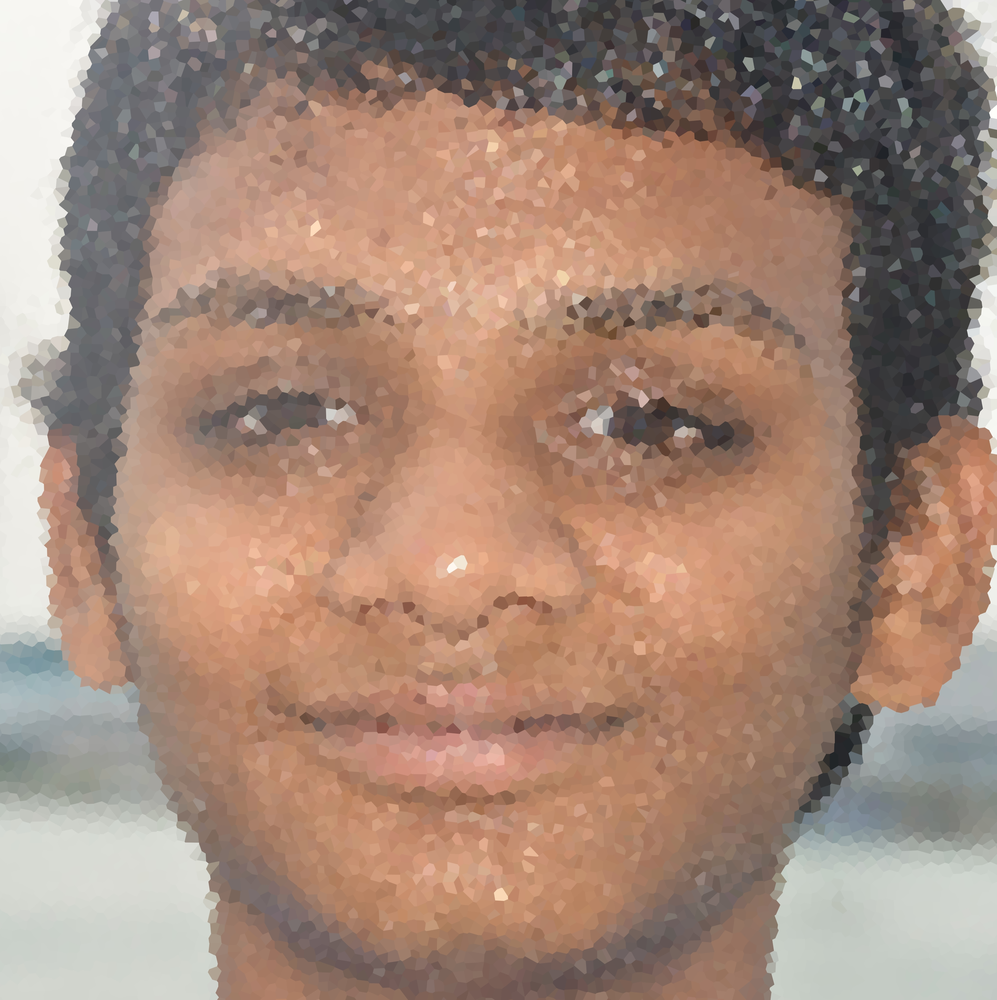

# Sandeep Battula's CSE 5912 Homework 2 site

The process to make this website was very easy.
I first made a repo for this website and I enable the website, which is one of the many setting/options in the repos settings.  
Then I added my final images, and a index file. 
Lastly I coded my index fine. 

I used [Paint.NET](http://www.getpaint.net/) to make my images cooler.

To make the first image I selected my face and then I inverted the selection and then I applied a Zoom blur.
Then I crop a bit of the image 
{width=720px} 

To make the middle image I Crystalized the original image, which is under the Distort menu.  
{width=720px} 

To make the last image I cropped the image, then under Artistic menu I applied the ink sketch.  
{width=720px} 
These people were my babysitters when I was seperated longterm from my actual family. 

#### Here are two elephants playing with each other

